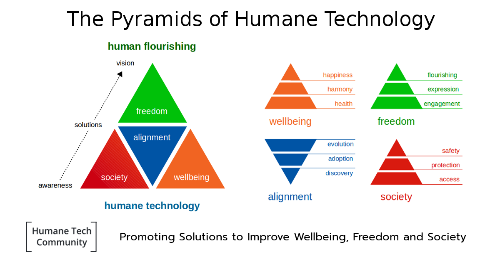

# Humane Tech Community Overview

## Community principles

### Vision

- _Ubiquitous Humane Technology that Stimulates Humans to Flourish and Humanity to Thrive._

### Mission

- _We Promote Solutions that Improve Wellbeing, Freedom and Society._
- _We Discover, Address and Help Eradicate The Harms of Technology._

### Philosophy

- _We Are For Everyone and Your Participating Should Be Fun and Rewarding!_
- _We Are a Solution Focused Team Who Engage Our Challenges With Optimism._
- _We Are One of Many Cooperating Teams and Actively Embrace New Partnerships._

---

### Announcement

This message contains the forum announcement: [Become a Builder :heart: Help Improve Wellbeing, Freedom and Society](https://community.humanetech.com/t/3322)

### New Forum Header: 

>**Welcome to Humane Tech Community!**    We promote  [_Embracing of Humane Technology So That Humans Can Flourish And Humanity Can Thrive._](https://community.humanetech.com/t/3322)

## Pyramids of Humane Technology model

### Overview

 

 

### Considerations

- There are 2 sweet spots that we are pursuing:
  1. **Humane Technology** as the sweet spot of technology innovation
  2. **Human Flourishing** as the sweet spot for human evolution

- The framework is optimistic and solution-oriented
  - Humane technology leads to human flourishing
  - Harms of technology are not mentioned or addressed at the abstract level
  - The 2 sweet spots will make both technologists and non-tech-savvy people feel at home

- We are building _The Pyramids of Humane Technology_ which are:

  1. The pyramid of (Technology) Alignment
  2. The pyramid of (Digital) Society
  3. The pyramid of (Digital) Wellbeing
  4. The pyramid of (Digital) Freedom

- The pyramid of alignment is upside down, it grows towards the top, as alignment grows

- The others are regular shaped, narrowing, as they work towards an elusive goal

- Each pyramid has 3 levels, Maslow-like, where level 3 represents the top

- The anology to 'pyramid building' is used to explain community concepts and principles.

## Breakdown structure

The following paragraphs provide a breakdown of each of the pyramids into their constituent levels.

- Note: The Concepts are indicative of combinations that can be derived in various contexts. They are just examples.

### Pyramid of Technology Alignment

Concepts:

- From disruption to sustainable growth
- From revolution to evolution
- Technology evolves with humans
- Technology in service of humanity

| |Level | Topics |
| :---: | :--- | :--- |
| 1. | **discovery** | knowledge, insights, humane design | 
| 2. | **adoption** | ethics, best-practices, experience, exemplars | 
| 3. | **evolution** | innovation, sustainability, expansion, immersion | 

### Pyramid of Society

Concepts:

- From access to interaction
- From protection to savety

| |Level | Topics |
| :---: | :--- | :--- |
| 1. | **access** | availability, accessability, structure | 
| 2. | **protection** | rights, regulation, security, privacy, trust | 
| 3. | **safety** | interaction, communication, behavior, civility, inclusiveness, confidence |

### Pyramid of Wellbeing

Concepts:

- From health to happiness
- From acceptance to wholesomeness

| |Level | Topics |
| :---: | :--- | :--- |
| 1. | **health** | mental, physical, social skills | 
| 2. | **harmony** | balance, inter-personal, social network, diversity, culture | 
| 3. | **happiness** | wholesomeness, acceptance, mindfulness |

### Pyramid of Freedom

Concepts:

- From engagement to purpose
- From expression to flourishing
- From direction to the future

| |Level | Topics |
| :---: | :--- | :--- |
| 1. | **engagement** | participation, freedom of speech, information and expression | 
| 2. | **expression** | creativity, human values, genuine emotions | 
| 3. | **flourishing** | purpose, synergy, optimism, vision, direction |

